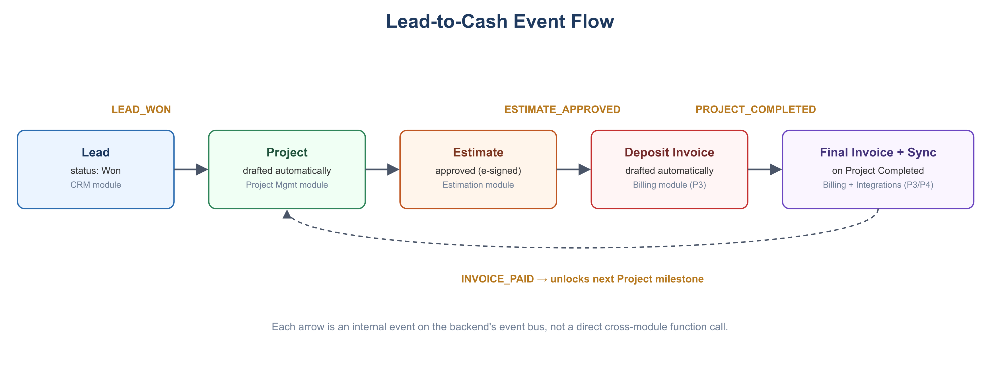
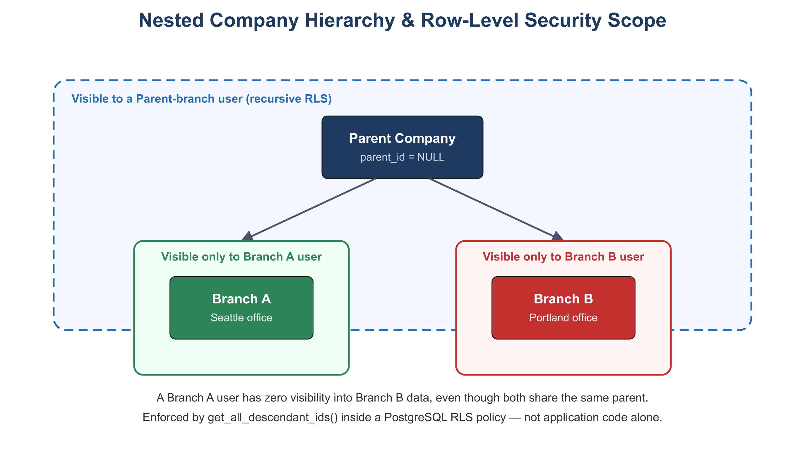
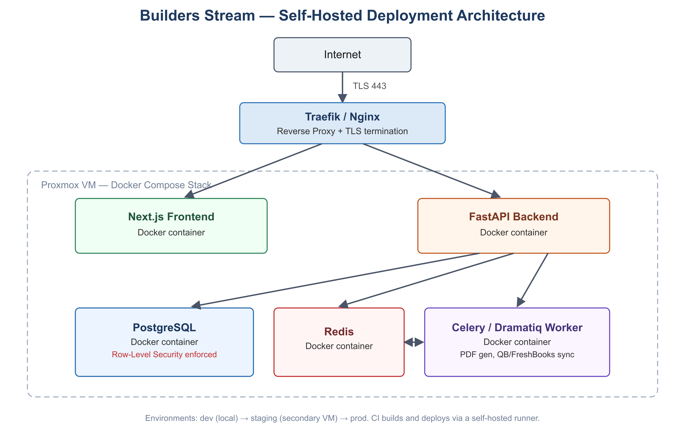

# Builders Stream — Technical Architecture

**Version:** 1.0
**Date:** 2026-07-07
**Related:** [PRD](01-prd.md) · [Functional Requirements](02-functional-requirements.md) · [Database Schema](04-database-schema.md) · [NFRs](06-nonfunctional-requirements.md)

## 1. Architecture Pattern

**Decoupled Modular Monolith.** The frontend and backend are independently deployable services communicating over a versioned HTTP/JSON API. The backend itself is a single deployable service internally organized into strictly-bounded modules (not a microservices mesh) — this avoids distributed-systems overhead while a solo developer builds out the platform, while keeping module boundaries clean enough to extract a module into its own service later if it becomes a scaling bottleneck.

## 2. Technology Stack

| Layer | Technology | Rationale |
|---|---|---|
| Frontend | Next.js 16 (App Router), TypeScript, Tailwind CSS v4 (+ hand-written, shadcn/ui-style Radix primitives) | Modern DX, strong ecosystem, SSR for client-facing dashboards. Foundation layer (auth, session handling, app shell, MFA management) implemented per [`docs/superpowers/specs/2026-07-16-frontend-foundation-design.md`](superpowers/specs/2026-07-16-frontend-foundation-design.md). |
| Backend | FastAPI (Python 3.12) | Async I/O, native OpenAPI schema generation, strong typing via Pydantic v2. |
| Database | PostgreSQL 16+ | Relational integrity, native Row-Level Security, JSONB for flexible fields. |
| ORM / Migrations | SQLAlchemy (async) + Alembic | Industry-standard Python persistence and migration tooling. |
| Background Tasks | Celery or Dramatiq + Redis | PDF generation, QuickBooks/FreshBooks sync, notification delivery. |
| Auth | OIDC/JWT-based (e.g., self-hosted Keycloak or a library such as Better Auth adapted to FastAPI) | Decouples identity from the API; supports future non-web clients. |
| Payments | Stripe (Billing + Customer Portal) | Handles Builders Stream's own subscription billing (not client-facing project invoicing). |
| Reverse Proxy / TLS | Traefik or Nginx + Let's Encrypt | Required for self-hosted deployment (Section 8). |
| Observability | Sentry (errors), PostHog (product analytics) | Self-hostable or cloud, both have generous free/self-host tiers. |
| API Contract | OpenAPI (auto-generated by FastAPI) → `openapi-typescript` | Frontend TypeScript types are generated from the backend schema, never hand-written, to prevent drift. |

## 3. Modular Domain Decomposition

The backend is organized as internal packages, one per bounded context:

```
src/
  core/        # tenant context, auth, RBAC, shared utilities
  users/       # Users & Company Management
  crm/         # CRM
  projects/    # Project Management
  estimation/  # Estimation Engine
  billing/     # Accounting & Billing
  integrations/# QuickBooks / FreshBooks sync
  compliance/  # Subcontractor certs, e-signature records (cross-cutting)
```

**Encapsulation rule:** a module may only read another module's data through that module's public service interface (a Python function/class), never by querying another module's tables directly. This is enforced by code review discipline (and can later be enforced mechanically with import-linter) rather than by physical service boundaries.

## 4. Cross-Module Communication: Internal Event Bus

Complex workflows span multiple modules (e.g., CRM lead → Project → Estimate → Invoice). Rather than modules calling each other synchronously and creating tight coupling, state-changing milestones publish events on an in-process (or Redis-backed) event bus:

| Event | Published By | Consumed By |
|---|---|---|
| `LEAD_WON` | CRM | Project Management (drafts a new Project) |
| `ESTIMATE_APPROVED` | Estimation | Billing (drafts deposit invoice) |
| `INVOICE_CREATED` | Accounting/Billing (AR), Estimation (auto-drafted deposit invoice on `ESTIMATE_APPROVED`) | Integrations (enqueues sync to every connected accounting provider) |
| `EXPENSE_CREATED` | Accounting/Billing | Integrations (enqueues sync to every connected accounting provider) |
| `BILL_CREATED` | Accounting/Billing (AP) | Integrations (enqueues sync to every connected accounting provider) |
| `PROJECT_COMPLETED` | Project Management | Billing (triggers final invoice), Integrations (enqueues sync to every connected accounting provider) — **not yet implemented**, see [`docs/superpowers/specs/2026-07-15-integrations-quickbooks-freshbooks-design.md`](superpowers/specs/2026-07-15-integrations-quickbooks-freshbooks-design.md) |
| `INVOICE_PAID` | Billing | Project Management (unlocks next milestone, if gated) — **not yet implemented** |

This keeps modules loosely coupled: Billing does not need to know CRM's internals, only that an `ESTIMATE_APPROVED` event carries a `project_id` and `approved_total`.



## 5. Multi-Tenancy & Data Isolation

### 5.1 Tenant Model

- **Shared database, shared schema.** All tenant data lives in the same tables; every tenant-owned table carries a `company_id`.
- **Nested company hierarchy.** `companies.parent_id` self-references, allowing parent/child branch structures (see [Database Schema](04-database-schema.md), Section 2).

### 5.2 Enforcement: PostgreSQL Row-Level Security (RLS)

RLS is the **primary** enforcement mechanism, not just a code-level `WHERE company_id = ...` convention — the database itself rejects cross-tenant access even if application code has a bug.

1. A `TenantMiddleware` in FastAPI extracts the active tenant's `company_id` from the validated JWT (or an `X-Tenant-ID` header for a user with access to multiple companies) and stores it in a `contextvars.ContextVar` for the duration of the request.
2. Before any database query executes, the connection issues `SET LOCAL app.current_tenant = '<company_id>'` for that transaction.
3. Every tenant-owned table has an RLS policy such as:
   ```sql
   USING (company_id IN (SELECT get_all_descendant_ids(current_setting('app.current_tenant')::uuid)))
   ```
   where `get_all_descendant_ids` is a recursive SQL function that returns the active company plus all of its child branches — giving parent-branch users visibility into child data while strictly isolating siblings from each other.
4. If the tree grows large enough that the recursive lookup becomes a measurable cost, the permitted `company_id` set can be cached in the user's session/JWT at login instead of recomputed per request (see [NFRs](06-nonfunctional-requirements.md), Section 2 for the trigger threshold).



### 5.3 Tenant Context Propagation (Frontend → Backend)

- Frontend attaches `Authorization: Bearer <jwt>` and, for multi-company users, an `X-Tenant-ID` header indicating the "active branch" selected in the UI.
- Backend middleware validates both before any module logic executes; requests without a resolvable tenant context are rejected (except public/auth routes).

## 6. Estimation Calculation Rules

To guarantee reproducible, auditable quotes, the Estimation module executes calculations server-side, in this fixed order, using Python's `decimal` module (never floats) for all currency math:

1. Line item base cost = `quantity × unit_rate`
2. Category subtotals
3. Overhead markup applied
4. Profit margin applied
5. Tax liability calculated (if applicable)

Client-submitted totals are always ignored in favor of a server-side recompute — the frontend calculation is a preview only.

## 7. Asynchronous Processing

Operations that are slow or involve third parties run as background tasks (Celery/Dramatiq workers backed by Redis), not inline in the request/response cycle:

- PDF generation for Estimate proposals (`/estimates/{id}/export`)
- QuickBooks/FreshBooks synchronization
- Compliance expiry notifications (insurance/license reminders)
- Outbound transactional email

The API returns `202 Accepted` immediately for these operations; the frontend polls or receives a websocket/notification event when the job completes.

## 8. Deployment Topology (Self-Hosted)

Target environment: the developer's own Proxmox/Dell PowerEdge infrastructure, not a managed cloud PaaS.



- Each component runs as a Docker container, orchestrated via Docker Compose (or a lightweight stack such as Docker Swarm) on a Proxmox VM.
- PostgreSQL data volume and Redis persistence are backed by scheduled, off-host backups (see [NFRs](06-nonfunctional-requirements.md), Section 4).
- Environments: `dev` (local), `staging` (a second Proxmox VM or namespace mirroring prod), `prod`.
- CI/CD: a self-hosted runner (e.g., Gitea Actions, Woodpecker CI, or GitHub Actions with a self-hosted runner) builds Docker images on push to `main`, runs the test suite (see [Test Strategy](10-test-strategy.md)), and deploys to `staging` automatically; promotion to `prod` is a manual, deliberate step.

## 9. Open Architectural Question: Mobile/Offline

Field crew offline support (Section 7 of the [PRD](01-prd.md)) is undecided. If required, it will most likely be implemented as a Progressive Web App (PWA) with local-first storage (e.g., IndexedDB) and background sync against the Project Management module's Daily Log and Task endpoints, rather than a separate native app — this preserves the single-frontend-codebase principle. This is **not** part of the current architecture and would require its own design pass before implementation.
