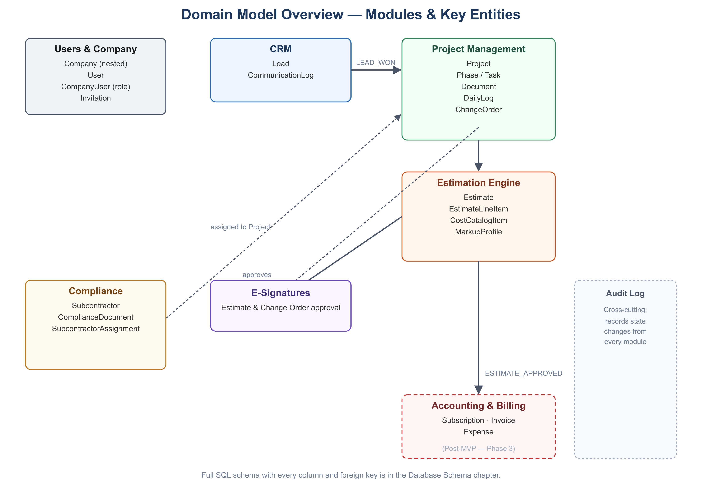

# Builders Stream — Database Schema Design

**Version:** 1.0
**Date:** 2026-07-07
**Related:** [Technical Architecture](03-technical-architecture.md) · [Functional Requirements](02-functional-requirements.md)

All primary keys are `UUID DEFAULT gen_random_uuid()`. All tenant-owned tables carry `company_id UUID NOT NULL REFERENCES companies(id)` and have Row-Level Security enabled per [Technical Architecture](03-technical-architecture.md), Section 5. Timestamps are `TIMESTAMP WITH TIME ZONE`.

Tables below are grouped by module for readability, not by migration order. Some tables reference others defined in a later section (e.g., `change_orders` in Section 4 references `esignatures` from Section 6) — actual Alembic migrations must sequence `CREATE TABLE` statements by foreign-key dependency, not by this document's section order.

## 1. Entity-Relationship Overview



The diagram above groups entities by module for readability. The full entity-relationship graph, including every foreign key, is expressed precisely in the SQL below (Sections 2–8).

## 2. Users & Company Management (P0)

```sql
CREATE TABLE companies (
    id UUID PRIMARY KEY DEFAULT gen_random_uuid(),
    parent_id UUID REFERENCES companies(id) ON DELETE CASCADE,
    name VARCHAR(255) NOT NULL,
    created_at TIMESTAMPTZ DEFAULT now(),
    is_active BOOLEAN DEFAULT TRUE
);
CREATE INDEX idx_companies_parent_id ON companies(parent_id);

CREATE TABLE users (
    id UUID PRIMARY KEY DEFAULT gen_random_uuid(),
    email VARCHAR(255) UNIQUE NOT NULL,
    password_hash TEXT NOT NULL,
    full_name VARCHAR(255),
    created_at TIMESTAMPTZ DEFAULT now()
);

CREATE TABLE company_users (
    company_id UUID REFERENCES companies(id) ON DELETE CASCADE,
    user_id UUID REFERENCES users(id) ON DELETE CASCADE,
    role VARCHAR(50) NOT NULL CHECK (role IN ('admin','project_manager','field_crew','accountant','client')),
    created_at TIMESTAMPTZ DEFAULT now(),
    PRIMARY KEY (company_id, user_id)
);

CREATE TABLE invitations (
    id UUID PRIMARY KEY DEFAULT gen_random_uuid(),
    company_id UUID NOT NULL REFERENCES companies(id) ON DELETE CASCADE,
    email VARCHAR(255) NOT NULL,
    role VARCHAR(50) NOT NULL,
    expires_at TIMESTAMPTZ NOT NULL,
    accepted_at TIMESTAMPTZ
);

-- Recursive descendant lookup, used by RLS policies across all tenant tables
CREATE OR REPLACE FUNCTION get_all_descendant_ids(company_uuid UUID)
RETURNS TABLE (child_id UUID) AS $$
    WITH RECURSIVE company_tree AS (
        SELECT id FROM companies WHERE id = company_uuid
        UNION ALL
        SELECT c.id FROM companies c INNER JOIN company_tree ct ON c.parent_id = ct.id
    )
    SELECT id FROM company_tree;
$$ LANGUAGE sql STABLE;

ALTER TABLE companies ENABLE ROW LEVEL SECURITY;
CREATE POLICY tenant_isolation_policy ON companies
    USING (id IN (SELECT get_all_descendant_ids(current_setting('app.current_tenant')::uuid)));
```

## 3. CRM (P1)

```sql
CREATE TABLE leads (
    id UUID PRIMARY KEY DEFAULT gen_random_uuid(),
    company_id UUID NOT NULL REFERENCES companies(id),
    contact_name VARCHAR(255) NOT NULL,
    project_name VARCHAR(255) NOT NULL,
    email VARCHAR(255) NOT NULL,
    phone VARCHAR(20),
    status VARCHAR(20) NOT NULL DEFAULT 'new'
        CHECK (status IN ('new','contacted','estimating','qualified','won','lost')),
    estimated_value NUMERIC(12,2),
    project_type VARCHAR(100) NOT NULL,
    notes TEXT,
    created_at TIMESTAMPTZ DEFAULT now(),
    updated_at TIMESTAMPTZ DEFAULT now()
);
CREATE INDEX idx_leads_company_status ON leads(company_id, status);

CREATE TABLE communication_logs (
    id UUID PRIMARY KEY DEFAULT gen_random_uuid(),
    lead_id UUID NOT NULL REFERENCES leads(id) ON DELETE CASCADE,
    company_id UUID NOT NULL REFERENCES companies(id),
    author_id UUID NOT NULL REFERENCES users(id),
    channel VARCHAR(20) NOT NULL CHECK (channel IN ('call','email','note','sms')),
    body TEXT NOT NULL,
    created_at TIMESTAMPTZ DEFAULT now()
    -- Immutable by convention: no updated_at, no UPDATE grants at the application layer.
);

ALTER TABLE leads ENABLE ROW LEVEL SECURITY;
CREATE POLICY tenant_isolation_policy ON leads
    USING (company_id IN (SELECT get_all_descendant_ids(current_setting('app.current_tenant')::uuid)));
ALTER TABLE communication_logs ENABLE ROW LEVEL SECURITY;
CREATE POLICY tenant_isolation_policy ON communication_logs
    USING (company_id IN (SELECT get_all_descendant_ids(current_setting('app.current_tenant')::uuid)));
```

## 4. Project Management (P1)

```sql
CREATE TABLE projects (
    id UUID PRIMARY KEY DEFAULT gen_random_uuid(),
    company_id UUID NOT NULL REFERENCES companies(id),
    lead_id UUID REFERENCES leads(id),
    name VARCHAR(255) NOT NULL,
    site_address TEXT NOT NULL,
    status VARCHAR(20) NOT NULL DEFAULT 'draft'
        CHECK (status IN ('draft','pre_construction','active','suspended','completed','archived')),
    projected_start_date DATE,
    created_at TIMESTAMPTZ DEFAULT now(),
    updated_at TIMESTAMPTZ DEFAULT now()
);

CREATE TABLE phases (
    id UUID PRIMARY KEY DEFAULT gen_random_uuid(),
    project_id UUID NOT NULL REFERENCES projects(id) ON DELETE CASCADE,
    company_id UUID NOT NULL REFERENCES companies(id),
    name VARCHAR(255) NOT NULL,
    sequence INT NOT NULL DEFAULT 0
);

CREATE TABLE tasks (
    id UUID PRIMARY KEY DEFAULT gen_random_uuid(),
    phase_id UUID NOT NULL REFERENCES phases(id) ON DELETE CASCADE,
    company_id UUID NOT NULL REFERENCES companies(id),
    name VARCHAR(255) NOT NULL,
    assignee_id UUID REFERENCES users(id),
    due_date DATE,
    status VARCHAR(20) NOT NULL DEFAULT 'open' CHECK (status IN ('open','in_progress','done')),
    created_at TIMESTAMPTZ DEFAULT now()
);

CREATE TABLE documents (
    id UUID PRIMARY KEY DEFAULT gen_random_uuid(),
    project_id UUID NOT NULL REFERENCES projects(id) ON DELETE CASCADE,
    company_id UUID NOT NULL REFERENCES companies(id),
    file_name VARCHAR(255) NOT NULL,
    storage_path TEXT NOT NULL,
    version INT NOT NULL DEFAULT 1,
    uploaded_by UUID NOT NULL REFERENCES users(id),
    created_at TIMESTAMPTZ DEFAULT now()
);

CREATE TABLE daily_logs (
    id UUID PRIMARY KEY DEFAULT gen_random_uuid(),
    project_id UUID NOT NULL REFERENCES projects(id) ON DELETE CASCADE,
    company_id UUID NOT NULL REFERENCES companies(id),
    author_id UUID NOT NULL REFERENCES users(id),
    log_date DATE NOT NULL,
    weather VARCHAR(100),
    notes TEXT,
    created_at TIMESTAMPTZ DEFAULT now()
    -- Immutable once submitted (application-layer enforced).
);

CREATE TABLE change_orders (
    id UUID PRIMARY KEY DEFAULT gen_random_uuid(),
    project_id UUID NOT NULL REFERENCES projects(id) ON DELETE CASCADE,
    company_id UUID NOT NULL REFERENCES companies(id),
    description TEXT NOT NULL,
    cost_delta NUMERIC(12,2) NOT NULL,
    schedule_impact_days INT DEFAULT 0,
    status VARCHAR(20) NOT NULL DEFAULT 'pending' CHECK (status IN ('pending','approved','rejected')),
    esignature_id UUID REFERENCES esignatures(id),
    created_at TIMESTAMPTZ DEFAULT now()
);

-- RLS policies follow the same tenant_isolation_policy pattern as Section 3 for every table above.
```

## 5. Estimation Engine (P1/P2)

```sql
CREATE TABLE markup_profiles (
    id UUID PRIMARY KEY DEFAULT gen_random_uuid(),
    company_id UUID NOT NULL REFERENCES companies(id),
    name VARCHAR(255) NOT NULL,
    overhead_pct NUMERIC(5,2) NOT NULL DEFAULT 0,
    profit_pct NUMERIC(5,2) NOT NULL DEFAULT 0
);

CREATE TABLE cost_catalog_items (
    id UUID PRIMARY KEY DEFAULT gen_random_uuid(),
    company_id UUID NOT NULL REFERENCES companies(id),
    parent_catalog_item_id UUID REFERENCES cost_catalog_items(id), -- links a branch override to its parent's item
    category VARCHAR(100) NOT NULL,
    name VARCHAR(255) NOT NULL,
    unit VARCHAR(50) NOT NULL, -- e.g., 'sqft', 'hour', 'each'
    unit_rate NUMERIC(12,2) NOT NULL,
    updated_at TIMESTAMPTZ DEFAULT now()
);

CREATE TABLE estimates (
    id UUID PRIMARY KEY DEFAULT gen_random_uuid(),
    company_id UUID NOT NULL REFERENCES companies(id),
    project_id UUID REFERENCES projects(id),
    lead_id UUID REFERENCES leads(id),
    markup_profile_id UUID NOT NULL REFERENCES markup_profiles(id),
    status VARCHAR(20) NOT NULL DEFAULT 'draft'
        CHECK (status IN ('draft','sent','approved','rejected')),
    subtotal NUMERIC(12,2),
    total NUMERIC(12,2),
    is_snapshotted BOOLEAN NOT NULL DEFAULT FALSE, -- true once approved; line items become immutable
    esignature_id UUID REFERENCES esignatures(id),
    created_at TIMESTAMPTZ DEFAULT now(),
    updated_at TIMESTAMPTZ DEFAULT now()
);

CREATE TABLE estimate_line_items (
    id UUID PRIMARY KEY DEFAULT gen_random_uuid(),
    estimate_id UUID NOT NULL REFERENCES estimates(id) ON DELETE CASCADE,
    company_id UUID NOT NULL REFERENCES companies(id),
    cost_catalog_item_id UUID NOT NULL REFERENCES cost_catalog_items(id),
    quantity NUMERIC(12,2) NOT NULL,
    unit_rate_snapshot NUMERIC(12,2) NOT NULL, -- copied at add-time; immune to later catalog price changes
    line_total NUMERIC(12,2) NOT NULL
);
```

## 6. E-Signatures & Compliance (Cross-Cutting)

```sql
CREATE TABLE esignatures (
    id UUID PRIMARY KEY DEFAULT gen_random_uuid(),
    company_id UUID NOT NULL REFERENCES companies(id),
    signer_name VARCHAR(255) NOT NULL,
    signer_email VARCHAR(255) NOT NULL,
    signed_at TIMESTAMPTZ NOT NULL,
    ip_address INET NOT NULL,
    signature_artifact_path TEXT NOT NULL, -- rendered signature image/hash, retained per Security & Compliance doc
    document_type VARCHAR(20) NOT NULL CHECK (document_type IN ('estimate','change_order'))
);

CREATE TABLE subcontractors (
    id UUID PRIMARY KEY DEFAULT gen_random_uuid(),
    company_id UUID NOT NULL REFERENCES companies(id),
    name VARCHAR(255) NOT NULL,
    trade VARCHAR(100),
    contact_email VARCHAR(255),
    created_at TIMESTAMPTZ DEFAULT now()
);

CREATE TABLE compliance_documents (
    id UUID PRIMARY KEY DEFAULT gen_random_uuid(),
    subcontractor_id UUID NOT NULL REFERENCES subcontractors(id) ON DELETE CASCADE,
    company_id UUID NOT NULL REFERENCES companies(id),
    doc_type VARCHAR(30) NOT NULL CHECK (doc_type IN ('insurance_certificate','license')),
    storage_path TEXT NOT NULL,
    expires_on DATE NOT NULL,
    created_at TIMESTAMPTZ DEFAULT now()
);
CREATE INDEX idx_compliance_expiry ON compliance_documents(company_id, expires_on);

CREATE TABLE subcontractor_assignments (
    id UUID PRIMARY KEY DEFAULT gen_random_uuid(),
    project_id UUID NOT NULL REFERENCES projects(id) ON DELETE CASCADE,
    subcontractor_id UUID NOT NULL REFERENCES subcontractors(id),
    company_id UUID NOT NULL REFERENCES companies(id),
    assigned_by UUID NOT NULL REFERENCES users(id),
    override_reason TEXT, -- populated only when assigned despite expired compliance docs (audit trail)
    created_at TIMESTAMPTZ DEFAULT now()
);
```

## 7. Post-MVP Tables (Phase 3–4, Structure Only)

These are documented now for forward compatibility of foreign keys but are not built until [Roadmap](09-roadmap-implementation-plan.md) Phase 3–4.

```sql
CREATE TABLE subscriptions ( -- Builders Stream's own SaaS billing, distinct from client invoicing
    id UUID PRIMARY KEY DEFAULT gen_random_uuid(),
    company_id UUID NOT NULL REFERENCES companies(id),
    stripe_customer_id VARCHAR(255) NOT NULL,
    stripe_subscription_id VARCHAR(255) NOT NULL,
    tier VARCHAR(20) NOT NULL CHECK (tier IN ('starter','pro','enterprise')),
    status VARCHAR(20) NOT NULL,
    current_period_end TIMESTAMPTZ
);

CREATE TABLE invoices ( -- client-facing project invoices (AR)
    id UUID PRIMARY KEY DEFAULT gen_random_uuid(),
    project_id UUID NOT NULL REFERENCES projects(id),
    company_id UUID NOT NULL REFERENCES companies(id),
    estimate_id UUID REFERENCES estimates(id), -- NULL for invoices created directly, not auto-generated from an approved Estimate
    invoice_number VARCHAR(20) NOT NULL, -- per-company sequential, assigned at creation (e.g. INV-2026-0001) — unique PER COMPANY, not globally
    amount NUMERIC(12,2) NOT NULL,
    status VARCHAR(20) NOT NULL DEFAULT 'draft' CHECK (status IN ('draft','sent','paid','overdue','void')),
    due_date DATE,
    created_at TIMESTAMPTZ DEFAULT now(),
    UNIQUE (company_id, invoice_number)
);

CREATE TABLE invoice_payments ( -- append-only ledger of payments RECEIVED from the client
    id UUID PRIMARY KEY DEFAULT gen_random_uuid(),
    invoice_id UUID NOT NULL REFERENCES invoices(id) ON DELETE CASCADE,
    company_id UUID NOT NULL REFERENCES companies(id),
    amount NUMERIC(12,2) NOT NULL,
    paid_date DATE NOT NULL,
    recorded_by UUID NOT NULL REFERENCES users(id),
    created_at TIMESTAMPTZ DEFAULT now()
);

CREATE TABLE bills ( -- amounts owed to vendors/subcontractors (AP)
    id UUID PRIMARY KEY DEFAULT gen_random_uuid(),
    company_id UUID NOT NULL REFERENCES companies(id),
    project_id UUID REFERENCES projects(id), -- NULL for company-wide overhead bills (rent, insurance, etc.)
    subcontractor_id UUID REFERENCES subcontractors(id), -- NULL for non-Subcontractor vendors
    vendor_name VARCHAR(255), -- required when subcontractor_id is NULL
    bill_number VARCHAR(50), -- the vendor's own reference number, free text
    amount NUMERIC(12,2) NOT NULL,
    status VARCHAR(20) NOT NULL DEFAULT 'unpaid' CHECK (status IN ('unpaid','paid','overdue','void')),
    due_date DATE,
    created_at TIMESTAMPTZ DEFAULT now(),
    CHECK (subcontractor_id IS NOT NULL OR vendor_name IS NOT NULL)
);

CREATE TABLE bill_payments ( -- append-only ledger of payments MADE to vendors
    id UUID PRIMARY KEY DEFAULT gen_random_uuid(),
    bill_id UUID NOT NULL REFERENCES bills(id) ON DELETE CASCADE,
    company_id UUID NOT NULL REFERENCES companies(id),
    amount NUMERIC(12,2) NOT NULL,
    paid_date DATE NOT NULL,
    recorded_by UUID NOT NULL REFERENCES users(id),
    created_at TIMESTAMPTZ DEFAULT now()
);

CREATE TABLE expenses ( -- non-vendor project costs (petty cash, mileage, direct purchases) — distinct from bills, which track a specific vendor's obligation
    id UUID PRIMARY KEY DEFAULT gen_random_uuid(),
    project_id UUID NOT NULL REFERENCES projects(id),
    company_id UUID NOT NULL REFERENCES companies(id),
    description VARCHAR(255) NOT NULL,
    amount NUMERIC(12,2) NOT NULL,
    incurred_on DATE NOT NULL
);

CREATE TABLE integration_connections ( -- QuickBooks / FreshBooks OAuth state
    id UUID PRIMARY KEY DEFAULT gen_random_uuid(),
    company_id UUID NOT NULL REFERENCES companies(id),
    provider VARCHAR(20) NOT NULL CHECK (provider IN ('quickbooks','freshbooks')),
    access_token_encrypted TEXT NOT NULL,
    refresh_token_encrypted TEXT NOT NULL,
    connected_at TIMESTAMPTZ DEFAULT now()
);
```

## 8. Audit Log (Cross-Cutting, P0)

```sql
CREATE TABLE audit_log (
    id UUID PRIMARY KEY DEFAULT gen_random_uuid(),
    company_id UUID NOT NULL REFERENCES companies(id),
    actor_id UUID REFERENCES users(id),
    action VARCHAR(100) NOT NULL, -- e.g., 'project.status_changed', 'subcontractor.assigned_with_expired_docs'
    entity_type VARCHAR(50) NOT NULL,
    entity_id UUID NOT NULL,
    metadata JSONB,
    created_at TIMESTAMPTZ DEFAULT now()
);
CREATE INDEX idx_audit_log_company_created ON audit_log(company_id, created_at DESC);
```

## 9. Indexing & RLS Notes

- Every `company_id` foreign key column should be indexed; most access patterns filter or join on it.
- RLS policies for every table in Sections 3–6 and 8 follow the identical pattern shown in Section 3 — omitted per-table above for brevity, but is a **mandatory** part of each table's migration, not optional.
- `estimate_line_items.unit_rate_snapshot` and `cost_catalog_items.unit_rate` are intentionally separate columns — this is what implements the historical-immutability rule from [Functional Requirements](02-functional-requirements.md), Section 4.
