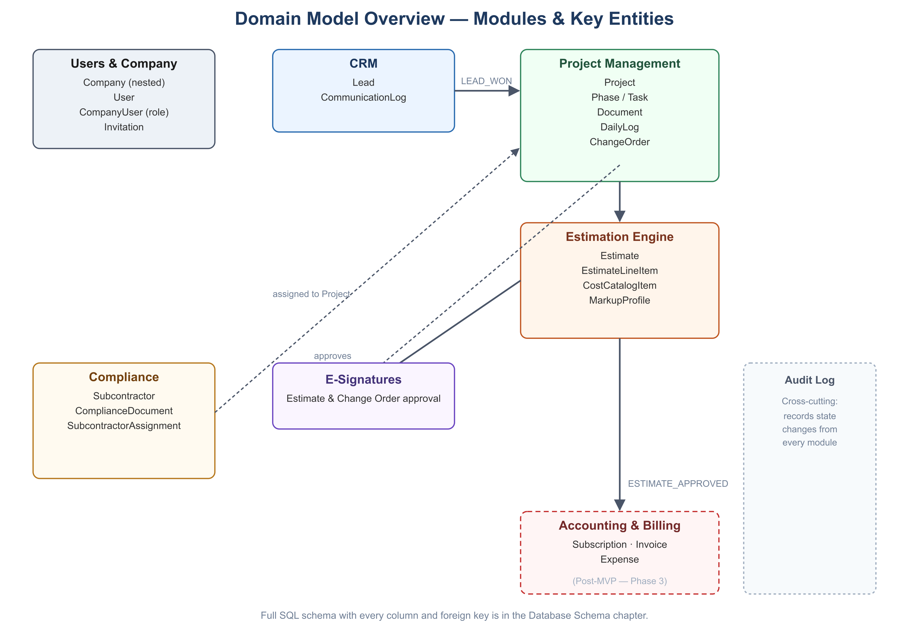

# Builders Stream — Database Schema Design

**Version:** 1.0
**Date:** 2026-07-07
**Related:** [Technical Architecture](03-technical-architecture.md) · [Functional Requirements](02-functional-requirements.md)

All primary keys are `UUID DEFAULT gen_random_uuid()`. All tenant-owned tables carry `company_id UUID NOT NULL REFERENCES companies(id)` and have Row-Level Security enabled per [Technical Architecture](03-technical-architecture.md), Section 5. Timestamps are `TIMESTAMP WITH TIME ZONE`.

Tables below are grouped by module for readability, not by migration order. Some tables reference others defined in a later section (e.g., `change_orders` in Section 4 references `esignatures` from Section 6) — actual Alembic migrations must sequence `CREATE TABLE` statements by foreign-key dependency, not by this document's section order.

## 1. Entity-Relationship Overview



The diagram above groups entities by module for readability. The full entity-relationship graph, including every foreign key, is expressed precisely in the SQL below (Sections 2–8).

## 2. Users & Company Management (P0)

```sql
CREATE TABLE companies (
    id UUID PRIMARY KEY DEFAULT gen_random_uuid(),
    parent_id UUID REFERENCES companies(id) ON DELETE CASCADE,
    name VARCHAR(255) NOT NULL,
    created_at TIMESTAMPTZ DEFAULT now(),
    is_active BOOLEAN DEFAULT TRUE
);
CREATE INDEX idx_companies_parent_id ON companies(parent_id);

CREATE TABLE users (
    id UUID PRIMARY KEY DEFAULT gen_random_uuid(),
    email VARCHAR(255) UNIQUE NOT NULL,
    password_hash TEXT NOT NULL,
    full_name VARCHAR(255),
    created_at TIMESTAMPTZ DEFAULT now()
);

CREATE TABLE company_users (
    company_id UUID REFERENCES companies(id) ON DELETE CASCADE,
    user_id UUID REFERENCES users(id) ON DELETE CASCADE,
    role VARCHAR(50) NOT NULL CHECK (role IN ('admin','project_manager','field_crew','accountant','client')),
    created_at TIMESTAMPTZ DEFAULT now(),
    PRIMARY KEY (company_id, user_id)
);

CREATE TABLE invitations (
    id UUID PRIMARY KEY DEFAULT gen_random_uuid(),
    company_id UUID NOT NULL REFERENCES companies(id) ON DELETE CASCADE,
    email VARCHAR(255) NOT NULL,
    role VARCHAR(50) NOT NULL,
    expires_at TIMESTAMPTZ NOT NULL,
    accepted_at TIMESTAMPTZ
);

-- Recursive descendant lookup, used by RLS policies across all tenant tables
CREATE OR REPLACE FUNCTION get_all_descendant_ids(company_uuid UUID)
RETURNS TABLE (child_id UUID) AS $$
    WITH RECURSIVE company_tree AS (
        SELECT id FROM companies WHERE id = company_uuid
        UNION ALL
        SELECT c.id FROM companies c INNER JOIN company_tree ct ON c.parent_id = ct.id
    )
    SELECT id FROM company_tree;
$$ LANGUAGE sql STABLE;

ALTER TABLE companies ENABLE ROW LEVEL SECURITY;
CREATE POLICY tenant_isolation_policy ON companies
    USING (id IN (SELECT get_all_descendant_ids(current_setting('app.current_tenant')::uuid)));
```

## 3. CRM (P1)

```sql
CREATE TABLE leads (
    id UUID PRIMARY KEY DEFAULT gen_random_uuid(),
    company_id UUID NOT NULL REFERENCES companies(id),
    contact_name VARCHAR(255) NOT NULL,
    project_name VARCHAR(255) NOT NULL,
    email VARCHAR(255) NOT NULL,
    phone VARCHAR(20),
    status VARCHAR(20) NOT NULL DEFAULT 'new'
        CHECK (status IN ('new','contacted','estimating','qualified','won','lost')),
    estimated_value NUMERIC(12,2),
    project_type VARCHAR(100) NOT NULL,
    notes TEXT,
    created_at TIMESTAMPTZ DEFAULT now(),
    updated_at TIMESTAMPTZ DEFAULT now()
);
CREATE INDEX idx_leads_company_status ON leads(company_id, status);

CREATE TABLE communication_logs (
    id UUID PRIMARY KEY DEFAULT gen_random_uuid(),
    lead_id UUID NOT NULL REFERENCES leads(id) ON DELETE CASCADE,
    company_id UUID NOT NULL REFERENCES companies(id),
    author_id UUID NOT NULL REFERENCES users(id),
    channel VARCHAR(20) NOT NULL CHECK (channel IN ('call','email','note','sms')),
    body TEXT NOT NULL,
    created_at TIMESTAMPTZ DEFAULT now()
    -- Immutable by convention: no updated_at, no UPDATE grants at the application layer.
);

ALTER TABLE leads ENABLE ROW LEVEL SECURITY;
CREATE POLICY tenant_isolation_policy ON leads
    USING (company_id IN (SELECT get_all_descendant_ids(current_setting('app.current_tenant')::uuid)));
ALTER TABLE communication_logs ENABLE ROW LEVEL SECURITY;
CREATE POLICY tenant_isolation_policy ON communication_logs
    USING (company_id IN (SELECT get_all_descendant_ids(current_setting('app.current_tenant')::uuid)));
```

## 4. Project Management (P1)

```sql
CREATE TABLE projects (
    id UUID PRIMARY KEY DEFAULT gen_random_uuid(),
    company_id UUID NOT NULL REFERENCES companies(id),
    lead_id UUID REFERENCES leads(id),
    name VARCHAR(255) NOT NULL,
    site_address TEXT NOT NULL,
    status VARCHAR(20) NOT NULL DEFAULT 'draft'
        CHECK (status IN ('draft','pre_construction','active','suspended','completed','archived')),
    projected_start_date DATE,
    created_at TIMESTAMPTZ DEFAULT now(),
    updated_at TIMESTAMPTZ DEFAULT now()
);

CREATE TABLE phases (
    id UUID PRIMARY KEY DEFAULT gen_random_uuid(),
    project_id UUID NOT NULL REFERENCES projects(id) ON DELETE CASCADE,
    company_id UUID NOT NULL REFERENCES companies(id),
    name VARCHAR(255) NOT NULL,
    sequence INT NOT NULL DEFAULT 0
);

CREATE TABLE tasks (
    id UUID PRIMARY KEY DEFAULT gen_random_uuid(),
    phase_id UUID NOT NULL REFERENCES phases(id) ON DELETE CASCADE,
    company_id UUID NOT NULL REFERENCES companies(id),
    name VARCHAR(255) NOT NULL,
    assignee_id UUID REFERENCES users(id),
    due_date DATE,
    status VARCHAR(20) NOT NULL DEFAULT 'open' CHECK (status IN ('open','in_progress','done')),
    created_at TIMESTAMPTZ DEFAULT now()
);

CREATE TABLE documents (
    id UUID PRIMARY KEY DEFAULT gen_random_uuid(),
    project_id UUID NOT NULL REFERENCES projects(id) ON DELETE CASCADE,
    company_id UUID NOT NULL REFERENCES companies(id),
    file_name VARCHAR(255) NOT NULL,
    storage_path TEXT NOT NULL,
    version INT NOT NULL DEFAULT 1,
    uploaded_by UUID NOT NULL REFERENCES users(id),
    created_at TIMESTAMPTZ DEFAULT now()
);

CREATE TABLE daily_logs (
    id UUID PRIMARY KEY DEFAULT gen_random_uuid(),
    project_id UUID NOT NULL REFERENCES projects(id) ON DELETE CASCADE,
    company_id UUID NOT NULL REFERENCES companies(id),
    author_id UUID NOT NULL REFERENCES users(id),
    log_date DATE NOT NULL,
    weather VARCHAR(100),
    notes TEXT,
    -- Migration 0034. A key the CLIENT generates, so the field crew's
    -- offline queue can send the same log twice without writing it twice —
    -- which matters more here than anywhere else, because migration 0004
    -- REVOKEs UPDATE and DELETE on this table from app_user, so a duplicate
    -- could never be removed through the product. Nullable (every online
    -- caller omits it) and unique per company only among rows that supply
    -- one, which Postgres's default NULLS DISTINCT gives for free.
    client_reference UUID,
    created_at TIMESTAMPTZ DEFAULT now()
    -- Immutable once submitted (application-layer enforced).
);

CREATE UNIQUE INDEX uq_daily_logs_company_client_reference
    ON daily_logs (company_id, client_reference);

CREATE TABLE change_orders (
    id UUID PRIMARY KEY DEFAULT gen_random_uuid(),
    project_id UUID NOT NULL REFERENCES projects(id) ON DELETE CASCADE,
    company_id UUID NOT NULL REFERENCES companies(id),
    description TEXT NOT NULL,
    cost_delta NUMERIC(12,2) NOT NULL,
    schedule_impact_days INT DEFAULT 0,
    status VARCHAR(20) NOT NULL DEFAULT 'pending' CHECK (status IN ('pending','approved','rejected')),
    esignature_id UUID REFERENCES esignatures(id),
    created_at TIMESTAMPTZ DEFAULT now()
);

-- RLS policies follow the same tenant_isolation_policy pattern as Section 3 for every table above.
```

## 5. Estimation Engine (P1/P2)

```sql
CREATE TABLE markup_profiles (
    id UUID PRIMARY KEY DEFAULT gen_random_uuid(),
    company_id UUID NOT NULL REFERENCES companies(id),
    name VARCHAR(255) NOT NULL,
    overhead_pct NUMERIC(5,2) NOT NULL DEFAULT 0,
    profit_pct NUMERIC(5,2) NOT NULL DEFAULT 0
);

CREATE TABLE cost_catalog_items (
    id UUID PRIMARY KEY DEFAULT gen_random_uuid(),
    company_id UUID NOT NULL REFERENCES companies(id),
    parent_catalog_item_id UUID REFERENCES cost_catalog_items(id), -- links a branch override to its parent's item
    category VARCHAR(100) NOT NULL,
    name VARCHAR(255) NOT NULL,
    unit VARCHAR(50) NOT NULL, -- e.g., 'sqft', 'hour', 'each'
    unit_rate NUMERIC(12,2) NOT NULL,
    updated_at TIMESTAMPTZ DEFAULT now()
);

CREATE TABLE estimates (
    id UUID PRIMARY KEY DEFAULT gen_random_uuid(),
    company_id UUID NOT NULL REFERENCES companies(id),
    project_id UUID REFERENCES projects(id),
    lead_id UUID REFERENCES leads(id),
    markup_profile_id UUID NOT NULL REFERENCES markup_profiles(id),
    status VARCHAR(20) NOT NULL DEFAULT 'draft'
        CHECK (status IN ('draft','sent','approved','rejected')),
    subtotal NUMERIC(12,2),
    total NUMERIC(12,2),
    is_snapshotted BOOLEAN NOT NULL DEFAULT FALSE, -- true once approved; line items become immutable
    esignature_id UUID REFERENCES esignatures(id),
    created_at TIMESTAMPTZ DEFAULT now(),
    updated_at TIMESTAMPTZ DEFAULT now()
);

CREATE TABLE estimate_line_items (
    id UUID PRIMARY KEY DEFAULT gen_random_uuid(),
    estimate_id UUID NOT NULL REFERENCES estimates(id) ON DELETE CASCADE,
    company_id UUID NOT NULL REFERENCES companies(id),
    cost_catalog_item_id UUID NOT NULL REFERENCES cost_catalog_items(id),
    quantity NUMERIC(12,2) NOT NULL,
    unit_rate_snapshot NUMERIC(12,2) NOT NULL, -- copied at add-time; immune to later catalog price changes
    line_total NUMERIC(12,2) NOT NULL
);
```

## 6. E-Signatures & Compliance (Cross-Cutting)

```sql
CREATE TABLE esignatures (
    id UUID PRIMARY KEY DEFAULT gen_random_uuid(),
    company_id UUID NOT NULL REFERENCES companies(id),
    signer_name VARCHAR(255) NOT NULL,
    signer_email VARCHAR(255) NOT NULL,
    signed_at TIMESTAMPTZ NOT NULL,
    ip_address INET NOT NULL,
    signature_artifact_path TEXT NOT NULL, -- rendered signature image/hash, retained per Security & Compliance doc
    document_type VARCHAR(20) NOT NULL CHECK (document_type IN ('estimate','change_order'))
);

CREATE TABLE subcontractors (
    id UUID PRIMARY KEY DEFAULT gen_random_uuid(),
    company_id UUID NOT NULL REFERENCES companies(id),
    name VARCHAR(255) NOT NULL,
    trade VARCHAR(100),
    contact_email VARCHAR(255),
    created_at TIMESTAMPTZ DEFAULT now()
);

CREATE TABLE compliance_documents (
    id UUID PRIMARY KEY DEFAULT gen_random_uuid(),
    subcontractor_id UUID NOT NULL REFERENCES subcontractors(id) ON DELETE CASCADE,
    company_id UUID NOT NULL REFERENCES companies(id),
    doc_type VARCHAR(30) NOT NULL CHECK (doc_type IN ('insurance_certificate','license')),
    storage_path TEXT NOT NULL,
    expires_on DATE NOT NULL,
    created_at TIMESTAMPTZ DEFAULT now()
);
CREATE INDEX idx_compliance_expiry ON compliance_documents(company_id, expires_on);

CREATE TABLE subcontractor_assignments (
    id UUID PRIMARY KEY DEFAULT gen_random_uuid(),
    project_id UUID NOT NULL REFERENCES projects(id) ON DELETE CASCADE,
    subcontractor_id UUID NOT NULL REFERENCES subcontractors(id),
    company_id UUID NOT NULL REFERENCES companies(id),
    assigned_by UUID NOT NULL REFERENCES users(id),
    override_reason TEXT, -- populated only when assigned despite expired compliance docs (audit trail)
    created_at TIMESTAMPTZ DEFAULT now()
);
```

## 7. Post-MVP Tables (Phase 3–4, Structure Only)

These are documented now for forward compatibility of foreign keys but are not built until [Roadmap](09-roadmap-implementation-plan.md) Phase 3–4.

```sql
CREATE TABLE subscriptions ( -- Builders Stream's own SaaS billing, distinct from client invoicing
    id UUID PRIMARY KEY DEFAULT gen_random_uuid(),
    company_id UUID NOT NULL REFERENCES companies(id),
    stripe_customer_id VARCHAR(255) NOT NULL,
    stripe_subscription_id VARCHAR(255) NOT NULL,
    tier VARCHAR(20) NOT NULL CHECK (tier IN ('starter','pro','enterprise')),
    status VARCHAR(20) NOT NULL,
    current_period_end TIMESTAMPTZ,
    -- Set when a platform admin edits `status` by hand (Section 9). The
    -- Stripe webhook is otherwise last-write-wins on this column, so
    -- without this flag the next routine customer.subscription.updated
    -- event silently reverts the operator's change. While it is set the
    -- webhook still applies current_period_end — Stripe's own fact to own
    -- — and leaves status alone.
    manual_status_override BOOLEAN NOT NULL DEFAULT false
);

CREATE TABLE invoices ( -- client-facing project invoices (AR)
    id UUID PRIMARY KEY DEFAULT gen_random_uuid(),
    project_id UUID NOT NULL REFERENCES projects(id),
    company_id UUID NOT NULL REFERENCES companies(id),
    estimate_id UUID REFERENCES estimates(id), -- NULL for invoices created directly, not auto-generated from an approved Estimate
    invoice_number VARCHAR(20) NOT NULL, -- per-company sequential, assigned at creation (e.g. INV-2026-0001) — unique PER COMPANY, not globally
    amount NUMERIC(12,2) NOT NULL,
    status VARCHAR(20) NOT NULL DEFAULT 'draft' CHECK (status IN ('draft','sent','paid','overdue','void')),
    due_date DATE,
    created_at TIMESTAMPTZ DEFAULT now(),
    UNIQUE (company_id, invoice_number)
);

CREATE TABLE invoice_payments ( -- append-only ledger of payments RECEIVED from the client
    id UUID PRIMARY KEY DEFAULT gen_random_uuid(),
    invoice_id UUID NOT NULL REFERENCES invoices(id) ON DELETE CASCADE,
    company_id UUID NOT NULL REFERENCES companies(id),
    amount NUMERIC(12,2) NOT NULL,
    paid_date DATE NOT NULL,
    recorded_by UUID NOT NULL REFERENCES users(id),
    created_at TIMESTAMPTZ DEFAULT now()
);

CREATE TABLE bills ( -- amounts owed to vendors/subcontractors (AP)
    id UUID PRIMARY KEY DEFAULT gen_random_uuid(),
    company_id UUID NOT NULL REFERENCES companies(id),
    project_id UUID REFERENCES projects(id), -- NULL for company-wide overhead bills (rent, insurance, etc.)
    subcontractor_id UUID REFERENCES subcontractors(id), -- NULL for non-Subcontractor vendors
    vendor_name VARCHAR(255), -- required when subcontractor_id is NULL
    bill_number VARCHAR(50), -- the vendor's own reference number, free text
    amount NUMERIC(12,2) NOT NULL,
    status VARCHAR(20) NOT NULL DEFAULT 'unpaid' CHECK (status IN ('unpaid','paid','overdue','void')),
    due_date DATE,
    created_at TIMESTAMPTZ DEFAULT now(),
    CHECK (subcontractor_id IS NOT NULL OR vendor_name IS NOT NULL)
);

CREATE TABLE bill_payments ( -- append-only ledger of payments MADE to vendors
    id UUID PRIMARY KEY DEFAULT gen_random_uuid(),
    bill_id UUID NOT NULL REFERENCES bills(id) ON DELETE CASCADE,
    company_id UUID NOT NULL REFERENCES companies(id),
    amount NUMERIC(12,2) NOT NULL,
    paid_date DATE NOT NULL,
    recorded_by UUID NOT NULL REFERENCES users(id),
    created_at TIMESTAMPTZ DEFAULT now()
);

CREATE TABLE expenses ( -- non-vendor project costs (petty cash, mileage, direct purchases) — distinct from bills, which track a specific vendor's obligation
    id UUID PRIMARY KEY DEFAULT gen_random_uuid(),
    project_id UUID NOT NULL REFERENCES projects(id),
    company_id UUID NOT NULL REFERENCES companies(id),
    description VARCHAR(255) NOT NULL,
    amount NUMERIC(12,2) NOT NULL,
    incurred_on DATE NOT NULL
);

CREATE TABLE integration_connections ( -- QuickBooks / FreshBooks OAuth state
    id UUID PRIMARY KEY DEFAULT gen_random_uuid(),
    company_id UUID NOT NULL REFERENCES companies(id),
    provider VARCHAR(20) NOT NULL CHECK (provider IN ('quickbooks','freshbooks')),
    access_token_encrypted TEXT NOT NULL,
    refresh_token_encrypted TEXT NOT NULL,
    connected_at TIMESTAMPTZ DEFAULT now(),
    UNIQUE (company_id, provider) -- one active connection per company per provider; a company may hold both a QuickBooks and a FreshBooks connection at once
);

CREATE TABLE integration_sync_records ( -- per-record sync status against a connected provider (design spec 2026-07-15)
    id UUID PRIMARY KEY DEFAULT gen_random_uuid(),
    company_id UUID NOT NULL REFERENCES companies(id),
    connection_id UUID NOT NULL REFERENCES integration_connections(id),
    entity_type VARCHAR(20) NOT NULL CHECK (entity_type IN ('invoice','expense','bill')),
    entity_id UUID NOT NULL,
    status VARCHAR(20) NOT NULL CHECK (status IN ('pending','success','failed')) DEFAULT 'pending',
    attempt_count INT NOT NULL DEFAULT 0,
    last_error TEXT,
    last_attempted_at TIMESTAMPTZ,
    created_at TIMESTAMPTZ DEFAULT now(),
    UNIQUE (connection_id, entity_type, entity_id) -- mutable current-state per record, not an append-only attempt log
);
CREATE INDEX idx_integration_sync_records_connection_status ON integration_sync_records(connection_id, status);
```

## 8. Audit Log (Cross-Cutting, P0)

```sql
CREATE TABLE audit_log (
    id UUID PRIMARY KEY DEFAULT gen_random_uuid(),
    company_id UUID NOT NULL REFERENCES companies(id),
    actor_id UUID REFERENCES users(id),
    action VARCHAR(100) NOT NULL, -- e.g., 'project.status_changed', 'subcontractor.assigned_with_expired_docs'
    entity_type VARCHAR(50) NOT NULL,
    entity_id UUID NOT NULL,
    metadata JSONB,
    created_at TIMESTAMPTZ DEFAULT now()
);
CREATE INDEX idx_audit_log_company_created ON audit_log(company_id, created_at DESC);
```

## 9. Platform Administration (Cross-Tenant, migration 0023)

These two tables sit *above* the tenant hierarchy rather than inside it, and
each breaks one of this document's otherwise-universal rules on purpose.

```sql
-- Who may operate the cross-tenant console. NO company_id: a platform
-- admin belongs to no tenant, which is the point — the usual
-- `company_id`-scoped policy would be meaningless here.
CREATE TABLE platform_admins (
    id UUID PRIMARY KEY DEFAULT gen_random_uuid(),
    user_id UUID NOT NULL REFERENCES users(id),
    granted_by UUID REFERENCES users(id),
    granted_at TIMESTAMPTZ NOT NULL DEFAULT now(),
    revoked_at TIMESTAMPTZ, -- NULL = active; checked on EVERY request
    note TEXT
);
ALTER TABLE platform_admins ENABLE ROW LEVEL SECURITY;
-- Scoped to the caller's own id, not a tenant: it exists so the request
-- path can answer "am I a platform admin?" without being able to
-- enumerate who else is.
CREATE POLICY self_read ON platform_admins FOR SELECT
    USING (user_id = current_setting('app.current_user_id', true)::uuid);

-- Per-tenant entitlement overrides. Three-state by design: a row with
-- enabled = true GRANTS a module the plan withholds, enabled = false
-- WITHHOLDS one the plan grants, and no row at all defers to the tier.
CREATE TABLE company_module_overrides (
    id UUID PRIMARY KEY DEFAULT gen_random_uuid(),
    company_id UUID NOT NULL REFERENCES companies(id), -- always a ROOT company
    module VARCHAR(50) NOT NULL,
    enabled BOOLEAN NOT NULL,
    note TEXT,
    set_by UUID REFERENCES users(id),
    created_at TIMESTAMPTZ NOT NULL DEFAULT now(),
    CONSTRAINT uq_company_module_overrides_company_module UNIQUE (company_id, module)
);
ALTER TABLE company_module_overrides ENABLE ROW LEVEL SECURITY;
-- get_root_company_id, not get_all_descendant_ids: entitlements are held
-- by the root, so a child branch reads its root's row (the same
-- upward-visibility shape `subscriptions` uses).
CREATE POLICY tenant_isolation ON company_module_overrides FOR ALL
    USING (company_id = get_root_company_id(NULLIF(current_setting('app.current_tenant', true), '')::uuid))
    WITH CHECK (company_id = get_root_company_id(NULLIF(current_setting('app.current_tenant', true), '')::uuid));
```

**Neither table is writable from the application.** Migration 0023 revokes
`INSERT, UPDATE, DELETE` on both from `app_user` (the request path) *and*
`scanner` (the worker), so there is no code path reachable from an HTTP
request or a background job that can grant platform privilege or edit an
entitlement — privilege escalation into this tier is removed as a category
rather than defended against with a role check. Writes come from a fourth
database role, `platform_admin` (LOGIN, BYPASSRLS, owning nothing): SELECT
everywhere, DML on `company_module_overrides`, UPDATE on `subscriptions`,
INSERT on `audit_log`, and nothing else. Granting the privilege itself is
`backend/scripts/grant_platform_admin.py`, which runs as the table owner
and therefore requires database access and a shell.

Entitlement changes are audited into the **target tenant's** `audit_log`,
not a separate platform log, so a customer-facing "why did this change?"
question is answerable from the same place every other change is.

## 9b. Team directory, outbound email, account recovery (migrations 0026–0029)

Added after this document's original pass. Full column lists are in
`docs/13-database-erd.md`, which is re-derived from the live schema; what
follows is the reasoning a column list cannot carry.

**`professions`, `member_profiles`, `member_phones` (0026).** Each company's
own record of its people. `member_profiles` is keyed `(company_id, user_id)`
and carries a composite FK into `company_users` with `ON DELETE CASCADE` —
the profile describes a MEMBERSHIP, not a person, so offboarding takes the
address with it. It deliberately does not live on `users`: that table has no
RLS (it is read before any tenant context exists), so an address there would
be readable by every company the same person belongs to. `professions` is
unique per company on `lower(name)` via a functional index, and
`member_profiles.profession_id` is `ON DELETE SET NULL` — retiring a trade
neither blocks on its holders nor deletes them.

**`company_branding.email_sender_name` (0027).** `NOT NULL DEFAULT ''`, where
empty means "use the company's own name". Nullable would have made "unset"
and "deliberately blank" indistinguishable for a field where blank is not
something anyone wants to send.

**`password_reset_tokens` (0028).** The one table added here with no
`company_id` and no RLS policy, and the only one that needs the exception
argued: a reset is requested with no session and no membership resolved.
Only the SHA-256 of the secret is stored, `used_at` makes it single-use, and
`app_user` holds no DELETE — a spent row is evidence.

**`company_email_settings` (0029).** A tenant's own SMTP server, one row per
company. `password_encrypted` is a Fernet ciphertext under the same key the
integrations module uses for OAuth tokens, and no route returns it — the API
answers `has_password`. `enabled=false` keeps the settings while falling back
to the platform relay, which is what a company does during a provider outage.

## 9c. Real provider mappings, multi-company membership, tenant rates (migrations 0030–0033)

Same convention as 9b: full column lists live in `docs/13-database-erd.md`;
what follows is the reasoning.

**`integration_entity_mappings`, `integration_connections.provider_account_id`
(0030).** What a real provider needs and the fake never did. QuickBooks and
FreshBooks each mint their own id for a customer or vendor, so a second sync
of the same entity has to reuse it rather than create a duplicate — unique on
`(connection_id, entity_kind, local_key)`. `local_key` is deliberately the
display name that was matched on rather than a foreign key, because what is
mapped is not always a row here: a bill's vendor is free text on
`bills.vendor_name`, and an expense account is a provider-side concept with
no local counterpart at all. One table with an `entity_kind` discriminator
rather than three, since the rows are identical in shape and the lookup is
identical in every case. `provider_account_id` is the realm the tokens were
issued for — nullable, because the fake has no notion of one.

**`refresh_tokens.active_company_id` (0031).** The schema half of belonging
to more than one company. The access token carries `default_company_id` and
`auth.refresh` re-derives it on every rotation — deliberately, so a token
minted at login and one rotated at refresh cannot disagree. That rule is
kept, but its *source* had to change: with nowhere durable to record a
company the user switched to, the switch would revert at the next refresh
about fourteen minutes later, mid-task and with no error. The refresh-token
chain is the right home because it already survives an access token and is
already rotated as one unit. Nullable, where null means "use the default
membership" — which is what every pre-existing row means, so there is nothing
to back-fill. `ON DELETE SET NULL` rather than `CASCADE`, because losing a
company should log you out of *that* company, not sign you out everywhere.

The same migration gives `companies` a `self_membership` SELECT policy,
mirroring the one `company_users` has had since 0001. A switcher has to show
company *names*, and `companies` is otherwise scoped to
`get_all_descendant_ids(app.current_tenant)`, which by construction cannot
contain a company in an unrelated tree. It widens nothing else — permissive
policies are ORed, and this one can only ever add companies the caller
already holds a membership for and can already name via `company_users`. It
is on `tests/test_rls_policy_coverage.py`'s allowlist, so it is a reviewed
exception rather than a quiet one.

**`integration_sync_records.entity_type` (0032).** The `CHECK` has been
`('invoice','expense','bill')` since 0013 — exactly what could be synced
then. Payments sync now, so it widens by one value. Worth keeping rather than
dropping: the constraint is what caught this change needing a migration at
all, instead of letting a typo'd `entity_type` accumulate rows nothing reads.

**`company_financial_settings` (0033).** The deposit percentage and tax rate,
previously module constants in `app/services/invoicing.py` documented as
placeholders. Neither was ever really one number — a deposit percentage is
commercial policy that differs per builder, and a sales-tax rate differs by
jurisdiction, so two branches of the same company in different states
genuinely disagree. Resolved **independently per value**: the company's own
setting, else its **root** company's, else the code default (10% deposit, 0%
tax). Per value rather than per row, so stating a deposit policy does not
silently adopt the tax default; root fallback rather than plain per-company,
so a head office can set a policy once while a branch in another state still
overrides — deliberately *not* the root-only resolution `subscriptions` uses,
because a subscription genuinely belongs to the root and a tax rate does not.

## 10. Indexing & RLS Notes

- Every `company_id` foreign key column should be indexed; most access patterns filter or join on it.
- RLS policies for every table in Sections 3–6 and 8 follow the identical pattern shown in Section 3 — omitted per-table above for brevity, but is a **mandatory** part of each table's migration, not optional. Section 9's two tables are the documented exceptions and spell their policies out in full.
- Adding a tenant table means adding its policy in the same migration. This is enforced, not trusted: `tests/test_rls_policy_coverage.py` sweeps every table Postgres reports and fails on one that has no policy, a policy that does not actually scope by the tenant tree, or no `company_id` column and no explicit declaration that it holds no tenant data.
- `estimate_line_items.unit_rate_snapshot` and `cost_catalog_items.unit_rate` are intentionally separate columns — this is what implements the historical-immutability rule from [Functional Requirements](02-functional-requirements.md), Section 4.
