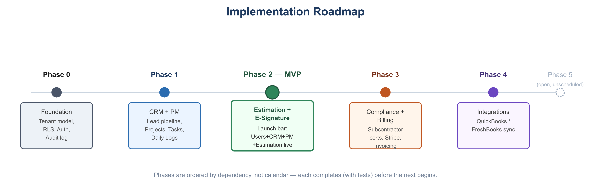

# Builders Stream — Roadmap & Implementation Plan

**Version:** 1.0
**Date:** 2026-07-07
**Related:** [PRD](01-prd.md) · [Functional Requirements](02-functional-requirements.md)

Pacing assumption: solo developer, no fixed external deadline. Phases are ordered by **dependency**, not by calendar — each phase should be substantially complete (including its tests, per [Test Strategy](10-test-strategy.md)) before the next begins, since later modules assume earlier ones exist and work correctly.

## Phase 0 — Foundation (Pre-MVP)

**Goal:** nothing else can be built safely without this.

- Dockerized dev environment (PostgreSQL, Redis, backend, frontend containers) per [Technical Architecture](03-technical-architecture.md), Section 8.
- `companies` / `users` / `company_users` schema + nested-hierarchy `parent_id` + `get_all_descendant_ids()` function.
- RLS policies enabled and proven on the Users & Company tables.
- `TenantMiddleware`: JWT validation → `contextvars` → `SET LOCAL app.current_tenant`.
- Auth: registration, login, invitations.
- Audit log table and a working write path.
- **Exit criteria:** automated RLS isolation tests (two companies, verify zero cross-visibility) pass in CI.

## Phase 1 — CRM & Project Management (MVP core)

- CRM: Lead CRUD, pipeline status transitions, communication logs.
- Project Management: Project CRUD/lifecycle state machine, Phases, Tasks, Documents, Daily Logs.
- `LEAD_WON` → draft Project event wiring (see [Technical Architecture](03-technical-architecture.md), Section 4).
- Client-facing read-only project dashboard (sanitized view, RBAC-scoped).
- **Exit criteria:** a Lead can be created, moved to Won, and land as a Draft Project with client details carried over, end-to-end, with tests.

## Phase 2 — Estimation Engine + E-Signature (MVP completion)

- Cost Catalog, Markup Profiles (with parent/child override inheritance).
- Estimate creation, line items, server-side calculation pipeline (fixed-point decimal, fixed order of operations).
- PDF export as an async job.
- E-signature capture flow for Estimate approval (`esignatures` table, [Security & Compliance](07-security-compliance.md), Section 6).
- Change Order creation + e-signature approval on active Projects (reuses the e-signature capability built for Estimates).
- Historical immutability / snapshotting on approval.
- `ESTIMATE_APPROVED` event published (consumed starting in Phase 3).
- **Exit criteria: this is the MVP launch bar.** Users/Company + CRM + Project Management + Estimation Engine (including e-signature) are feature-complete, tested, and deployed to production. This matches the MVP scope defined in [PRD](01-prd.md), Section 6.

## Phase 3 — Compliance Tracking + Accounting/Billing (Post-MVP)

Grouped together because both are needed before Enterprise-tier subscribers can be onboarded (see [Pricing Model](08-pricing-subscription-model.md), Section 3), and Billing's invoice generation is the natural consumer of the `ESTIMATE_APPROVED` event from Phase 2.

- Subcontractor/Vendor records, compliance document upload + expiry notifications, compliance dashboard, assignment override + audit logging.
- Builders Stream's own Stripe subscription billing (tiers, seats, Customer Portal, webhook sync).
- Client-facing Project invoicing (AR), vendor Bills (AP), and Expense tracking.
- Profitability reporting, including AR/AP aging and estimated tax liability.
- **Exit criteria:** a company can subscribe/pay via Stripe, an approved Estimate flows into a draft client invoice automatically, and Accountants can track both money owed to and owed by the company through to payment.

## Phase 4 — External Integrations (Post-MVP)

- QuickBooks OAuth connect + async sync of invoices/expenses.
- FreshBooks OAuth connect + async sync (same pattern).
- Sync status visibility and retry-on-failure handling.
- **Exit criteria:** Enterprise-tier companies can connect and see a successful, monitored sync.

## Phase 5 — Open Items (Scope TBD, Not Yet Scheduled)

These are explicitly deferred pending decisions noted in [PRD](01-prd.md), Section 8, and are **not** part of any committed phase above:

- Offline-capable mobile/PWA support for field crews.
- AI-assisted blueprint takeoff for the Estimation Engine.
- Multi-currency / multi-language support.

## Milestone Summary

| Phase | Delivers | Depends On |
|---|---|---|
| 0 | Multi-tenant foundation, auth, RLS | — |
| 1 | CRM + Project Management | Phase 0 |
| 2 | Estimation + e-signature — **MVP launch** | Phase 1 |
| 3 | Compliance + Billing | Phase 2 |
| 4 | QuickBooks/FreshBooks | Phase 3 |
| 5 | Open items (unscheduled) | Varies |
