# Database ERD

Generated from the **live schema** — a scratch database with all 34 Alembic
migrations applied — rather than from the ORM models or by hand, so it cannot
quietly drift from what `alembic upgrade head` actually produces.

**46 tables** (excluding `alembic_version`). Last re-derived 2026-08-02
against migration `0033`; the counts and the no-RLS list below come from
`pg_class`/`pg_attribute`, not from memory. Migrations `0034` and `0035`
added columns and no tables, so the counts stand — `daily_logs.client_reference`
and `estimate_line_items.description`/`.unit` are reflected in their blocks
below.

## Read this first: the tenant boundary is in the database

The single most important property of this schema is not visible in an
ordinary ERD: **PostgreSQL Row-Level Security is the tenant boundary**, not
application code. Every tenant table carries `company_id` and a `FOR ALL`
policy scoped by `get_all_descendant_ids(current_setting('app.current_tenant'))`,
so a query that forgets to filter by company still cannot cross tenants.

- RLS enabled: **43 of 46** tables
- Deliberately without RLS: `refresh_tokens`, `users`, `password_reset_tokens`

`users` is global by design (one person may belong to several companies, and
login happens before any tenant is known); `refresh_tokens` hangs off `users`
and is looked up by token hash, never by tenant.

`platform_admins` (migration 0023) is the one table with RLS enabled but **no
`company_id`** — a platform administrator belongs to no tenant, so the usual
policy would be meaningless. Its policy is scoped to the caller's own user id
instead, so the request path can ask "am I a platform admin?" without being
able to enumerate who else is. See [Database Schema](04-database-schema.md),
Section 9.

`companies.parent_id` self-references to form the branch hierarchy, and is
**immutable** — migration 0021 enforces that with a trigger, because
re-parenting would move a subtree between tenants and detach it from its
subscription.

## Tenancy spine

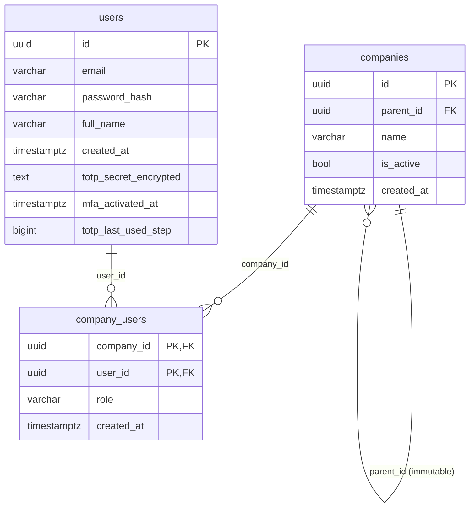

Membership is the join: a user's role is per-company, so the same person can
be an admin of one branch and a client of another.

## Tenancy, identity and access

> No RLS on: `users`, `refresh_tokens`, `password_reset_tokens` — see above.
> A reset is requested with no session, no `X-Tenant-ID` and no membership
> resolved, so there is no tenant to scope the row to; the credential is
> protected by being a SHA-256 of a secret that lives in one email
> (migration 0028).

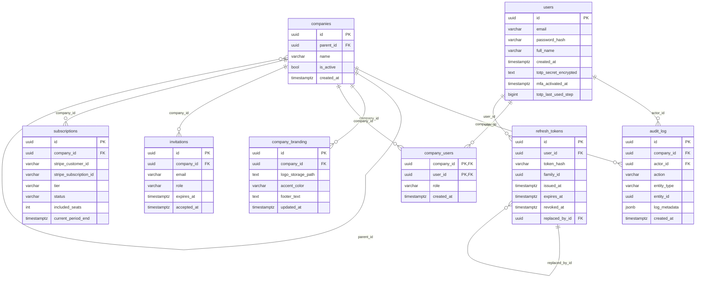

## CRM — leads

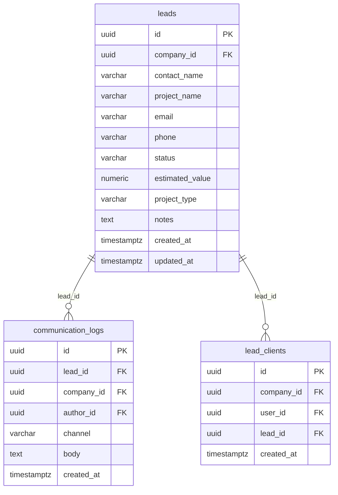

## Project management

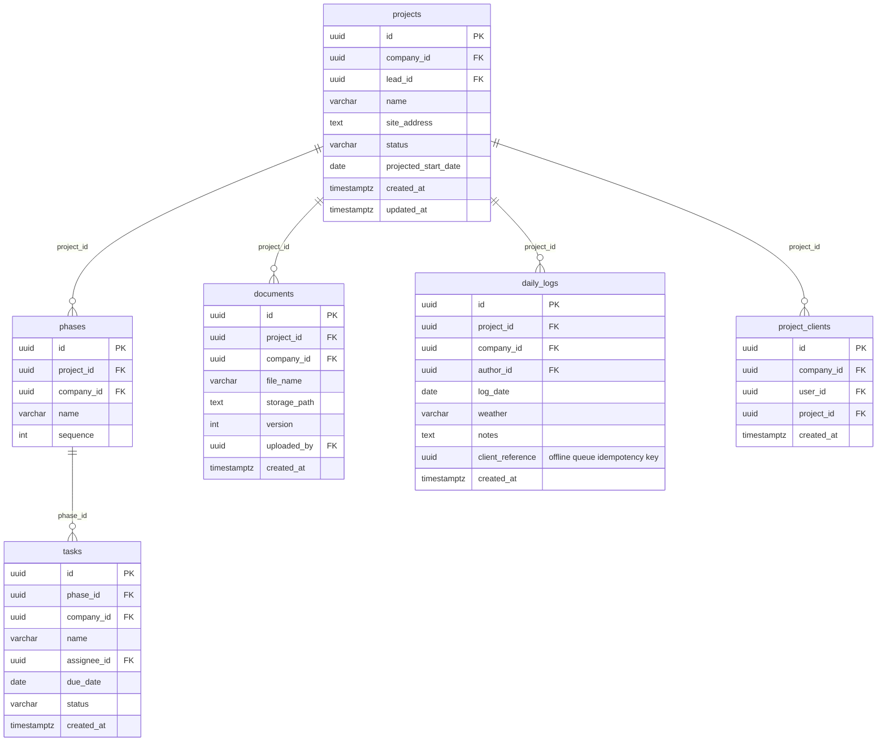

## Estimation and e-signature

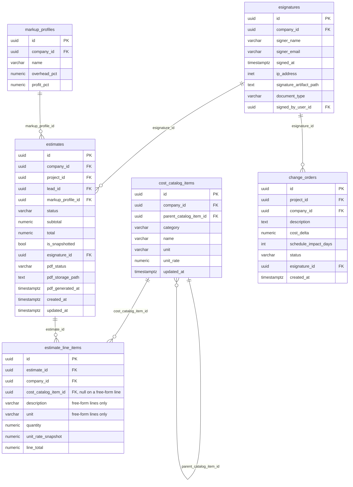

## Bill of Materials

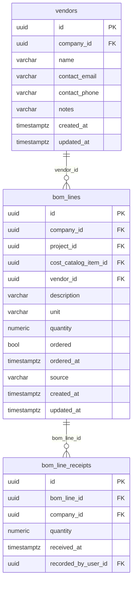

## Compliance tracking

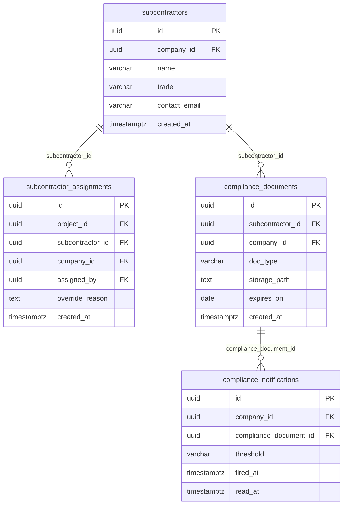

## Invoicing, AP and expenses

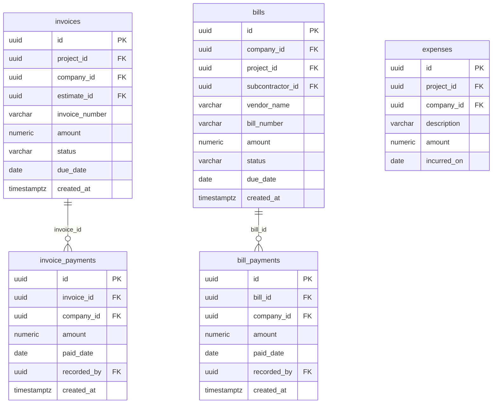

## Accounting integrations

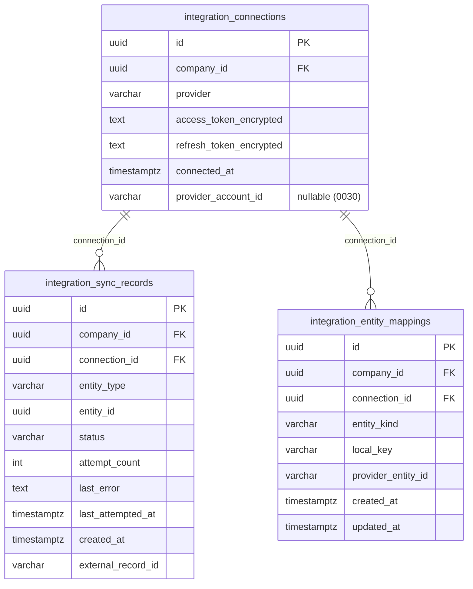

`integration_entity_mappings` (migration 0030) is what a *real* provider
needed and the fake never did: QuickBooks and FreshBooks each mint their own
id for a customer or vendor, and a second sync of the same entity must reuse
it rather than create a duplicate. Unique on
`(connection_id, entity_kind, local_key)`.

`local_key` is deliberately **the display name that was matched on, not a
foreign key** — what is being mapped is not always a row in this database. A
bill's vendor is free text on `bills.vendor_name`, and an expense account is
a provider-side concept with no local counterpart at all. For the same
reason it is one table with an `entity_kind` discriminator rather than three
(`customers`/`vendors`/`accounts`): identical shape, identical lookup, so
three tables would be three copies of the same policy, index and upsert.

`provider_account_id` on `integration_connections` is the realm/account the
tokens were issued for — nullable because the fake has no notion of one.

## Tenant financial settings (migration 0033)

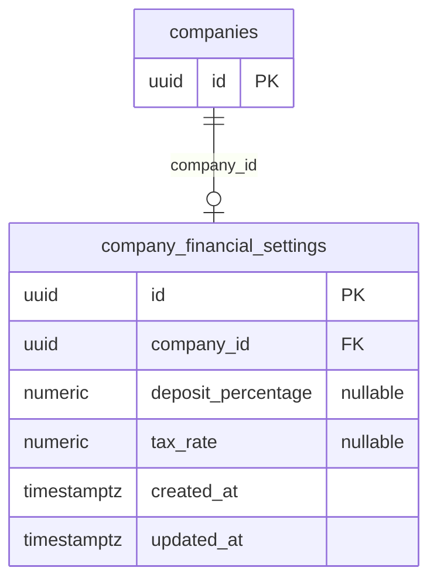

At most one row per company, holding the two rates that were previously
module constants in `app/services/invoicing.py`: the deposit percentage
`ESTIMATE_APPROVED` uses when it drafts a deposit invoice, and the tax rate
the profitability report applies to estimated liability. `numeric(6,5)`
stores a rate, not a percentage — 0.08250 is 8.25%.

Both columns are nullable and resolved **independently, per value**: the
company's own setting, else its **root** company's, else the code default
(10% deposit, 0% tax). Two properties follow, and both are deliberate:

- **Per value, not per row.** A tenant may want to state a deposit policy
  and leave tax alone; resolving the whole row would make setting one
  silently adopt the other's default.
- **Root fallback, not plain per-company.** A head office sets a policy once
  and branches follow it, while a branch in another state can still
  override. This is deliberately *not* the root-only resolution
  `subscriptions` uses — a subscription genuinely belongs to the root, but a
  tax rate is exactly the thing a branch needs to differ on.

Changing a rate does not rewrite history: a deposit invoice's amount is
computed at approval and stored, so invoices already raised keep the rate
they were agreed at. The report's tax figure *is* recomputed live, because
it is labelled an estimate of current liability rather than a record.

## Platform administration

The one group that sits *above* the tenant hierarchy rather than inside it.
Neither table is writable by `app_user` or `scanner` — migration 0023 revokes
`INSERT/UPDATE/DELETE` on both — so no HTTP request or background job can
grant platform privilege or edit an entitlement.

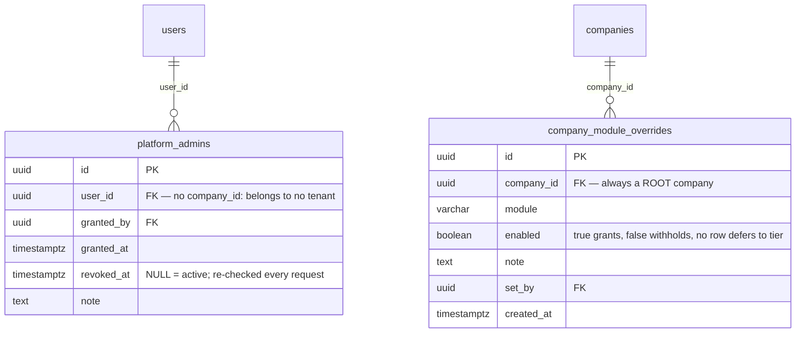

`enabled` is three-state on purpose, and the middle state is why the column
cannot simply be a boolean flag on `subscriptions`: **no row** means "use the
tier", `true` grants a module the tier would withhold, and `false` withholds
one the tier would grant. Collapsing the first two would make "off"
unexpressible.

## Team directory (migration 0026)

> Each company's own record of its people. The profile hangs off the
> MEMBERSHIP, not the user: `users` has no RLS by design (it is read before
> any tenant context exists), so an address stored there would be readable
> by every company that person also belongs to. The composite FK into
> `company_users` with ON DELETE CASCADE is what stops a profile outliving
> the membership it describes.

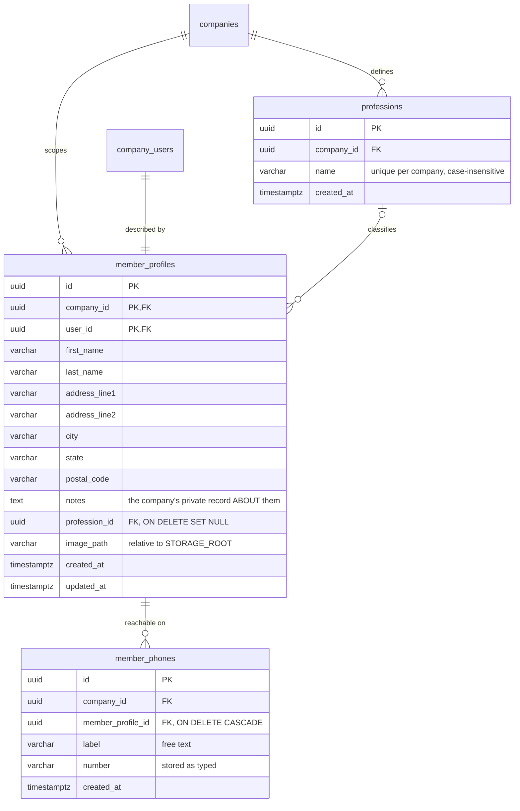

## Outbound email and account recovery (migrations 0027–0029)

> Two tables and one column that decide how mail leaves and how somebody
> gets back in. `company_branding.email_sender_name` (0027) is the display
> name in front of the address; `company_email_settings` (0029) is a
> tenant's own SMTP server, with the password held as a Fernet ciphertext
> and returned by no route. `password_reset_tokens` (0028) is the only
> table here outside the tenant model — see the no-RLS note at the top.

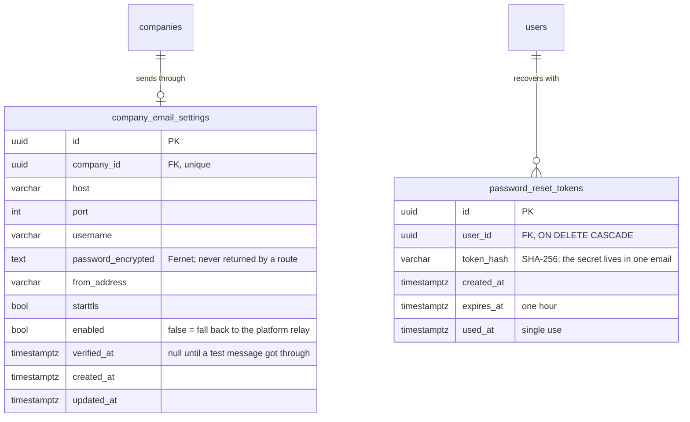

## Cross-domain foreign keys

Relationships that cross the groupings above, listed rather than drawn so the
per-domain diagrams stay readable.

| From | Column | References |
|---|---|---|
| `bill_payments` | `company_id` | `companies` |
| `bill_payments` | `recorded_by` | `users` |
| `bills` | `company_id` | `companies` |
| `bills` | `project_id` | `projects` |
| `bills` | `subcontractor_id` | `subcontractors` |
| `bom_line_receipts` | `company_id` | `companies` |
| `bom_line_receipts` | `recorded_by_user_id` | `users` |
| `bom_lines` | `company_id` | `companies` |
| `bom_lines` | `cost_catalog_item_id` | `cost_catalog_items` |
| `bom_lines` | `project_id` | `projects` |
| `change_orders` | `company_id` | `companies` |
| `change_orders` | `project_id` | `projects` |
| `communication_logs` | `author_id` | `users` |
| `communication_logs` | `company_id` | `companies` |
| `compliance_documents` | `company_id` | `companies` |
| `compliance_notifications` | `company_id` | `companies` |
| `company_financial_settings` | `company_id` | `companies` |
| `cost_catalog_items` | `company_id` | `companies` |
| `daily_logs` | `author_id` | `users` |
| `daily_logs` | `company_id` | `companies` |
| `documents` | `company_id` | `companies` |
| `documents` | `uploaded_by` | `users` |
| `esignatures` | `company_id` | `companies` |
| `esignatures` | `signed_by_user_id` | `users` |
| `estimate_line_items` | `company_id` | `companies` |
| `estimates` | `company_id` | `companies` |
| `estimates` | `lead_id` | `leads` |
| `estimates` | `project_id` | `projects` |
| `expenses` | `company_id` | `companies` |
| `expenses` | `project_id` | `projects` |
| `integration_connections` | `company_id` | `companies` |
| `integration_entity_mappings` | `company_id` | `companies` |
| `integration_sync_records` | `company_id` | `companies` |
| `invoice_payments` | `company_id` | `companies` |
| `invoice_payments` | `recorded_by` | `users` |
| `invoices` | `company_id` | `companies` |
| `invoices` | `estimate_id` | `estimates` |
| `invoices` | `project_id` | `projects` |
| `lead_clients` | `company_id` | `companies` |
| `lead_clients` | `user_id` | `users` |
| `leads` | `company_id` | `companies` |
| `markup_profiles` | `company_id` | `companies` |
| `phases` | `company_id` | `companies` |
| `project_clients` | `company_id` | `companies` |
| `project_clients` | `user_id` | `users` |
| `projects` | `company_id` | `companies` |
| `projects` | `lead_id` | `leads` |
| `subcontractor_assignments` | `assigned_by` | `users` |
| `subcontractor_assignments` | `company_id` | `companies` |
| `subcontractor_assignments` | `project_id` | `projects` |
| `subcontractors` | `company_id` | `companies` |
| `tasks` | `assignee_id` | `users` |
| `tasks` | `company_id` | `companies` |
| `vendors` | `company_id` | `companies` |

_54 cross-domain references._

